<a href="https://hilokeshrm.github.io">
  <picture>
    <source media="(prefers-color-scheme: dark)" srcset="assets/header-dark.svg">
    
  </picture>
</a>

<p align="center">
  <a href="https://hilokeshrm.github.io"></a>
  <a href="https://www.linkedin.com/in/thisislokeshrm"></a>
  <a href="mailto:hi.lokeshrm@gmail.com"></a>
  <a href="https://theanve.com"></a>
</p>

```text
$ whoami
lokesh — AI engineer @ Sirena Technologies, founder @ ANVE, freelancer on the side.
I take ideas from prototype to something real users rely on:
agents, robots, ESP32 devices, and the web app with the admin panel behind it.

$ cat /now
→ running the cloud brain for 80+ robots on a single GPU (VAD → ASR → LLM → TTS, ~60 ms)
→ sim-to-real locomotion for biped & quadruped robots (Isaac Sim · MuJoCo · ROS 2)
→ open for freelance work — UK · IN · remote, replies within a day
```

### ◆ Build log

| | Project | What it does |
|:-:|---|---|
| `01` | [**BlackwellCoordinator**](https://github.com/hilokeshrm/BlackwellCoordinator) | Traffic controller for a shared RTX PRO 6000: smart GPU queue, checkpoint/resume, live dashboard, and a Cursor MCP. |
| `02` | [**project_navigator_terminal**](https://github.com/hilokeshrm/project_navigator_terminal) | A terminal AI agent on OpenRouter + Ollama, with tools, web search, and MCP. |
| `03` | [**llms_benchmarks**](https://github.com/hilokeshrm/llms_benchmarks) | Benchmarks open-weight LLMs on a DGX: throughput, VRAM, power, and cost per token. |
| `04` | [**sirena-tools**](https://github.com/hilokeshrm/sirena-tools) | Web toolkit for Sirena's robot products. [Live ↗](https://hilokeshrm.github.io/sirena-tools/) |
| `05` | [**Twist-XL320**](https://github.com/hilokeshrm/Twist-XL320) | A mini spider bot built on Dynamixel XL320 servos. |

### ◆ Toolbox

<p>
  
</p>

<sub>Also: LangGraph · MCP · RAG · pgvector · ONNX · NVIDIA Jetson · ESP-IDF · Isaac Sim · MuJoCo · Gazebo</sub>

<p align="right"><sub><code>Bengaluru · 12.97° N · building something? → <a href="https://wa.me/919035446966">say hi</a></code></sub></p>
